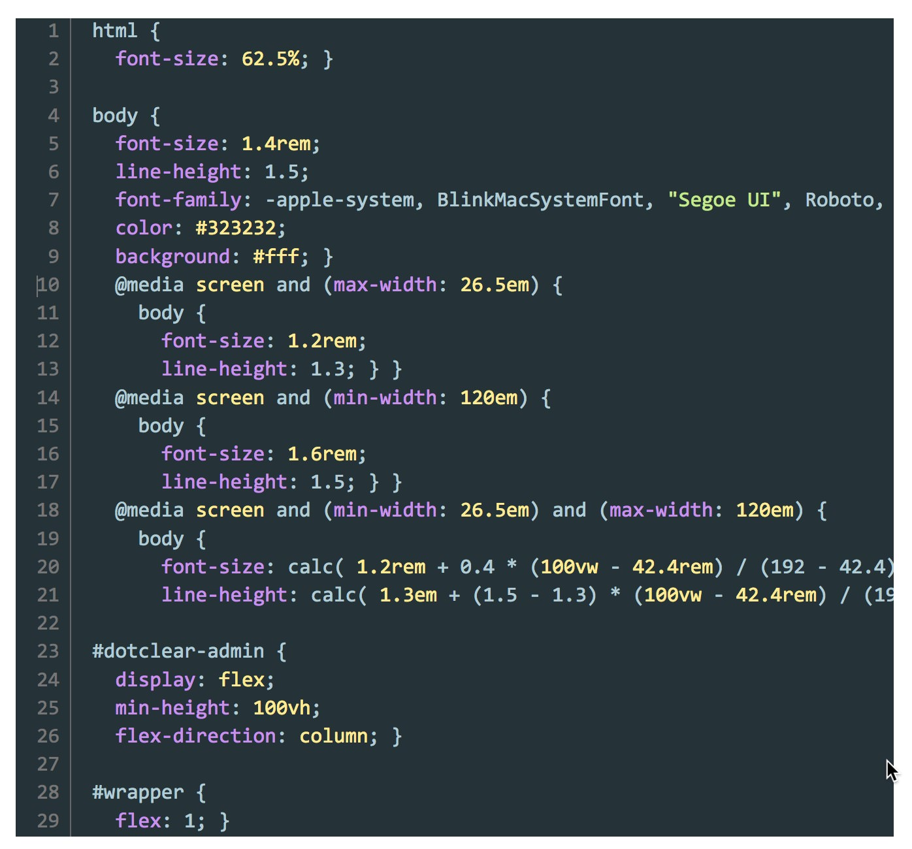

# YASH syntax highlighter plugin for Dotclear 2

!!! tip "Current release"
    [1.7 — 2017-03-04][ot-dl] (Dotclear 2.9+)


This plugin use the [SyntaxHighlighter script](http://alexgorbatchev.com/SyntaxHighlighter) from Alex Gorbatchev to render code blocks in posts and pages with syntax highlighting.

It supports 28 [syntaxes](/user-guide/usage#available-syntaxes) and provides 12 different [themes](/user-guide/settings#presentation).

## Example

The following CSS code:

```
html {
  font-size: 62.5%; }

body {
  font-size: 1.4rem;
  line-height: 1.5;
  font-family: -apple-system, BlinkMacSystemFont, "Segoe UI", Roboto, Oxygen-Sans, Ubuntu, Cantarell, "Helvetica Neue", sans-serif;
  color: #323232;
  background: #fff; }
  @media screen and (max-width: 26.5em) {
    body {
      font-size: 1.2rem;
      line-height: 1.3; } }
  @media screen and (min-width: 120em) {
    body {
      font-size: 1.6rem;
      line-height: 1.5; } }
  @media screen and (min-width: 26.5em) and (max-width: 120em) {
    body {
      font-size: calc( 1.2rem + 0.4 * (100vw - 42.4rem) / (192 - 42.4) );
      line-height: calc( 1.3em + (1.5 - 1.3) * (100vw - 42.4rem) / (192 - 42.4) ); } }

#dotclear-admin {
  display: flex;
  min-height: 100vh;
  flex-direction: column; }

#wrapper {
  flex: 1; }
```

Will be rendered as (using Material theme):



## Installation

The plugin may be downloaded and installed from following sources:

 * [DotAddict](http://plugins.dotaddict.org/dc2/details/yash)
 * [Open-Time][ot-dl]

Or directly from the administration plugins page of Dotclear

## Usage

The plugin **must** be activated before being used on your blog[^1]. See [user guide](user-guide/usage) for more information.

[^1]: Go to the main page of the YASH plugin to activated it (Blog section of the Dotclear admin menu).

[ot-dl]: https://open-time.net/post/2017/03/04/Plugin-Yash-17-pour-Dotclear
