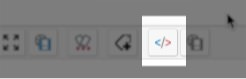

Usage
=====

The plugin should be activated for the blog (see main [setting page](/user-guide/settings) of this plugin) before using it.


Using YASH in content
---------------------

In order to specify codes to be rendered by YASH you have to use the following syntax:

In **Wiki** mode:

```
///yash language_code
...
///
```

In **HTML** (source) or **Markdown** modes:

```html
<pre class="brush: language_code">
...
</pre>
```

!!! note
	A toolbar button is available for dcLegacyEditor (wiki/markown and wysiwyg in source mode) to select syntax:  

	


Available syntaxes
------------------

| Language code | Syntaxe             |
| ------------- | ------------------- |
| plain         | Plain Text          |
| applescript   | AppleScript         |
| as3           | ActionScript3       |
| bash          | Bash/shell          |
| cf            | ColdFusion          |
| csharp        | C#                  |
| cpp           | C/C++               |
| css           | CSS                 |
| delphi        | Delphi              |
| diff          | Diff/Patch          |
| erl           | Erlang              |
| groovy        | Groovy              |
| haxe          | Haxe                |
| js            | Javascript/JSON     |
| java          | Java                |
| jfx           | JavaFX              |
| pl            | Perl                |
| php           | PHP                 |
| ps            | PowerShell          |
| python        | Python              |
| ruby          | Ruby                |
| sass          | SASS                |
| scala         | Scala               |
| sql           | SQL                 |
| tap           | Tap                 |
| ts            | TypeScript          |
| vb            | Visual Basic        |
| xml           | XML/XSLT/XHTML/HTML |
| yaml          | Yaml                |
